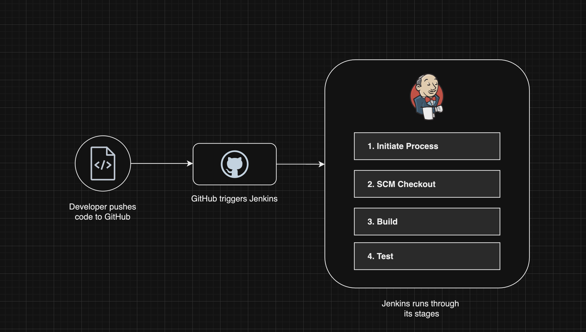
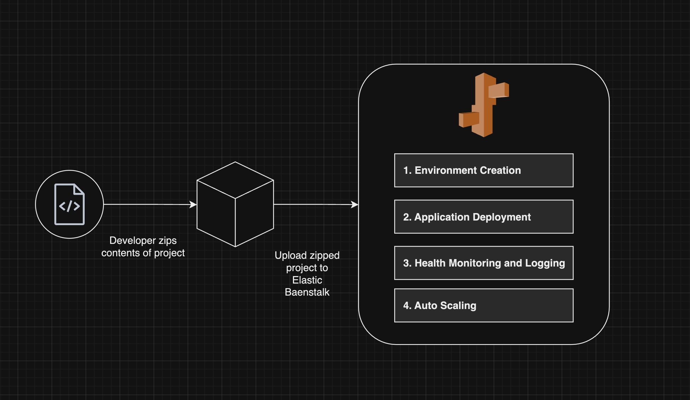

# Blue Sun Financial - CI/CD Pipeline Project


## Overview

The purpose is to demo a minimal implementation of a CI/CD (Continuous Integration and Continuous Deployment) pipeline for Blue Sun Financial―a fictional retail bank―including deploying it to the cloud. This minimal project showcases the integration of various tools including Jenkins, Amazon EC2, and AWS Elastic Beanstalk for a Python-based web application.

<div style="display: flex; justify-content: center; padding-top: 10px">


</div>

## Steps

### Part 1: Jenkins

1. **Launched EC2 Instance**:

   - Launched an EC2 instance to host Jenkins.
   - Cloned application code in a directory.

2. **Jenkins**:

   - Connected to the EC2 terminal.
   - Installed and started Jenkins on system:

   ```sudo apt update && sudo apt install fontconfig openjdk-17-jre software-properties-common && sudo add-apt-repository ppa:deadsnakes/ppa && sudo apt install python3.7 python3.7-venv
   sudo wget -O /usr/share/keyrings/jenkins-keyring.asc https://pkg.jenkins.io/debian-stable/jenkins.io-2023.key
   echo "deb [signed-by=/usr/share/keyrings/jenkins-keyring.asc]" https://pkg.jenkins.io/debian-stable binary/ | sudo tee /etc/apt/sources.list.d/jenkins.list > /dev/null
   sudo apt-get update
   sudo apt-get install jenkins
   sudo systemctl start jenkins
   sudo systemctl status jenkins
   ```

   - Accessed Jenkins through the EC2's public IP address on port 8080.
   - Completed initial setup steps including plugin installation and admin user creation.

3. **Multi-Branch Pipeline Creation**:

   - Set up a new Multi-Branch pipeline in Jenkins.
   - Connected the pipeline to the GitHub repository giving the repo URL and using personal access token for authentication.

4. **Build Process**:
   - Triggered the first build, which completed successfully.
   - Analyzed the build stages:
     - **Stage 1:** Starts the process.
     - **Stage 2**: This tells Jenkins to get the code from the GitHub repo I defined (my forked repo)
     - **Stage 3:** Sets up a Python virtual environment (venv) and installs all the necessary packages and dependencies of the project’s repo.
     - **Stage 4:** Activates the virtual environment the Build stage set up for us. Runs any test files specified, and documents the results in an file called `results.xml`

<br/>

### Successful Build


<hr />

### Part 2: Elastic Beanstalk

1. **IAM Role Setup**:

   - Created IAM roles for Elastic Beanstalk and EC2. One for Elastic Beanstalk, one for the EC2 instance it will be running on.
   - Configured the EC2 instance to be able to use other AWS services.
   - For the Elastic Beanstalk role, add these policies:
     - _AWSElasticBeanstalkWebTier_
     - _AWSElasticBeanstalkWorkerTier_
     - _AWSElasticBeanstalkMulticontainerDocker_

2. **Environment Creation on EB**:

   - Created a new web server environment for this project.
   - Selected Python 3.7 for the Python platform and selected the necessary instance specifications for this environment.

3. **Deploy Application**:
   - Created a zip archive of the project. Ran into an error with this, see [Troubleshooting](https://github.com/shafeeshafee/blue-sun-financial?tab=readme-ov-file#troubleshooting) below.
   - Uploaded it to Elastic Beanstalk.

## Troubleshooting

_All logs below have been obfuscated to redact network information._

#### Once the environment was complete configuring, upon clicking the Beanstalk environment a 502 Bad Gateway error occurred.

- Since it's a 502, this was an issue on serverside.
- Checking the last 100 lines in the log pinpointed several areas of concern, including these:

```

 ## /var/log/nginx/error.log

 2024/07/28 07:26:08 [error] 2712#2712: \*1 connect() failed (111: Connection refused) while connecting to upstream, client: 123.45.67.89, server: , request: "GET /index.html HTTP/1.1", upstream: "http://127.0.0.1:8000/index.html", host: "987.65.43.21"

 ...

 Jul 28 07:03:35 ip-123-11-22-321 web: ModuleNotFoundError: No module named 'application'
Jul 28 07:03:35 ip-123-11-22-321 web: [2024-07-28 07:03:35 +0000] [2778] [INFO] Worker exiting (pid: 2778)

```

**1. Initial attempts:**

- Considered changing PORT from 5000 to 8000 in source code.
- Opted to modify Elastic Beanstalk configuration instead.
- Changed port to 8000 in source code, but this didn't resolve the issue.

**2. Further investigation:**

- Researched WSGI, Gunicorn, and Procfile.
- Learned Elastic Beanstalk uses Gunicorn as the default WSGI server.
- Created a Procfile: `web: gunicorn application:application`
- Redeployed with newly added Procfile, but still encountered 502 Bad Gateway.

**4. Found the Issue!:**

- With the help of a colleague whose questions led me in the right direction, I realized the issue stemmed from directly downloading the ZIP file from GitHub's UI, which included an extra top-level parent directory.
- Elastic Beanstalk couldn't find the application at the root level (there was none, it was inside the directory itself).

**5. Solution:**

- Navigate to the project directory.
- Zip only the contents, ensuring files are at the root level.
- Deploy the correctly structured ZIP file.

## Visual Overview




## Optimization

While this is demonstrating a simplified CI/CD through Jenkins and deployment via Elastic Beanstalk, it's important to consider the pros and cons of using managed services for cloud infrastructure in a real-world scenario.

### Benefits at a high level:

- **Simplified Management:** Since Elastic Beanstalk is a managed service, it can handle a lot of operational tasks, reducing the workload on the dev teams.
- **Scalability:** It's easy to scale applications up or down based on demand.
- **Cost-Effective:** The infrastructure is abstracted, so there isn't a need to manage your infrastructure, developer teams can instead focus on pushing out code. This is useful especially for smaller teams and projects.
- **Automation:** The service provider handles system wide updates and security patches.
- **Monitoring and Logging:** Provides tools for monitoring application health and performance.

However, a real retail bank app (unlike our fictional Blue Sun Financial) might face some challenges when using this method of deployment:

- Retail banks handle sensitive financial data and must adhere to with strict regulations. To address this, banks should implement encryption, perform regular security checks and audits, and choose services that offer compliance certifications.

- Managed services may restrict the level of customization needed for specific banking operations. In other words, there bank may require a specific way of doing transactions that a managed service like Elastic Beanstalk wouldn't be able to provide. Banks can address this by carefully seeing the service's customization options and implementing a hybrid approach if need be.

- Becoming overly dependent on a single cloud provider's ecosystem can be risky, i.e., vendor lock-in. To resolve this, banks should design their applications with portability in mind and consider multi-cloud
  strategies.

## Conclusion

This project successfully demonstrated a simple implementation of a CI/CD pipeline for Blue Sun Financial using Jenkins and AWS Elastic Beanstalk. Through this process, we gained valuable insights into automating software deployment, troubleshooting in cloud environments, and the nature of managed services.

While the application itself is minimalistic, the principles and practices used are doable to more real-world scenarios. It also shows the importance of understanding both the benefits and challenges of cloud infrastructure in modern software development.
