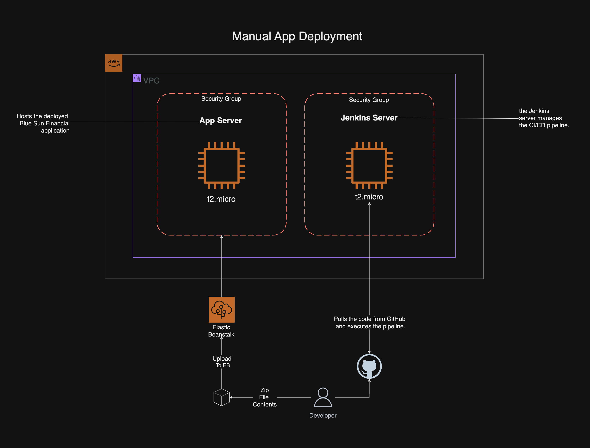

# Blue Sun CI/CD Pipeline


## Overview

**Blue Sun CI/CD Pipeline** demonstrates a minimal yet robust implementation of a CI/CD (Continuous Integration and Continuous Deployment) pipeline, including deployment to the cloud. This project integrates essential tools such as Jenkins, Amazon EC2, and AWS Elastic Beanstalk to deploy a Python-based web application efficiently.

### Significance

This workload establishes a foundational understanding of CI/CD principles and the role of managed services in streamlining deployment processes. By introducing core CI/CD concepts and practical experience with Jenkins and AWS Elastic Beanstalk, it sets the stage for more advanced DevOps practices.

<div style="display: flex; justify-content: center; padding-top: 10px">
  
  
  
  
</div>

## Features

- **Automated CI/CD Pipeline:** Utilizes Jenkins for continuous integration and deployment.
- **Cloud Deployment:** Deploys the application to AWS Elastic Beanstalk, ensuring scalability and reliability.
- **Python-Based Web Application:** Showcases deployment of a Python web app, highlighting language-specific configurations.
- **Troubleshooting and Optimization:** Provides insights into common issues and best practices for cloud deployments.

## Table of Contents

- [Overview](#overview)
- [Features](#features)
- [Steps](#steps)
  - [Part 1: Jenkins](#part-1-jenkins)
  - [Part 2: Elastic Beanstalk](#part-2-elastic-beanstalk)
- [Troubleshooting](#troubleshooting)
- [Visual Overview](#visual-overview)
- [Optimization](#optimization)
- [Conclusion](#conclusion)
- [License](#license)
- [Contact](#contact)

## Steps

### Part 1: Jenkins

1. **Launch EC2 Instance:**

   - Launched an EC2 instance to host Jenkins.
   - Cloned the application code into a designated directory.

2. **Set Up Jenkins:**

   - Connected to the EC2 terminal.
   - Installed and started Jenkins on the system:

     ```bash
     sudo apt update && sudo apt install fontconfig openjdk-17-jre software-properties-common -y
     sudo add-apt-repository ppa:deadsnakes/ppa -y
     sudo apt install python3.7 python3.7-venv -y
     sudo wget -O /usr/share/keyrings/jenkins-keyring.asc https://pkg.jenkins.io/debian-stable/jenkins.io-2023.key
     echo "deb [signed-by=/usr/share/keyrings/jenkins-keyring.asc] https://pkg.jenkins.io/debian-stable binary/" | sudo tee /etc/apt/sources.list.d/jenkins.list > /dev/null
     sudo apt-get update
     sudo apt-get install jenkins -y
     sudo systemctl start jenkins
     sudo systemctl status jenkins
     ```

   - Accessed Jenkins via the EC2's public IP address on port `8080`.
   - Completed initial setup, including plugin installation and admin user creation.

3. **Create Multi-Branch Pipeline:**

   - Set up a new Multi-Branch pipeline in Jenkins.
   - Connected the pipeline to the GitHub repository using the repository URL and a personal access token for authentication.

4. **Build Process:**
   - Triggered the first build, which completed successfully.
   - Analyzed the build stages:
     - **Stage 1:** Initiates the build process.
     - **Stage 2:** Retrieves the code from the specified GitHub repository.
     - **Stage 3:** Sets up a Python virtual environment (`venv`) and installs necessary packages and dependencies.
     - **Stage 4:** Activates the virtual environment, runs specified test files, and documents the results in a `results.xml` file.

<br/>

### Successful Build


<hr />

### Part 2: Elastic Beanstalk

1. **IAM Role Setup:**

   - Created IAM roles for Elastic Beanstalk and EC2.
   - Configured the EC2 instance to interact with other AWS services.
   - Assigned the following policies to the Elastic Beanstalk role:
     - _AWSElasticBeanstalkWebTier_
     - _AWSElasticBeanstalkWorkerTier_
     - _AWSElasticBeanstalkMulticontainerDocker_

2. **Environment Creation on Elastic Beanstalk:**

   - Created a new web server environment for the project.
   - Selected Python 3.7 as the platform and configured necessary instance specifications.

3. **Deploy Application:**
   - Created a ZIP archive of the project. Encountered an error during this step (see [Troubleshooting](#troubleshooting) below).
   - Uploaded the ZIP file to Elastic Beanstalk.

## Troubleshooting

_All logs below have been obfuscated to redact network information._

#### Issue: 502 Bad Gateway Error After Environment Configuration

- **Symptoms:**
  - Upon accessing the Elastic Beanstalk environment, a `502 Bad Gateway` error was encountered.
- **Analysis:**

  - The error indicated a server-side issue.
  - Reviewed the last 100 lines in the log, identifying several critical errors:

    ```
    ## /var/log/nginx/error.log

    2024/07/28 07:26:08 [error] 2712#2712: *1 connect() failed (111: Connection refused) while connecting to upstream, client: 123.45.67.89, server: , request: "GET /index.html HTTP/1.1", upstream: "http://127.0.0.1:8000/index.html", host: "987.65.43.21"
    ...

    Jul 28 07:03:35 ip-123-11-22-321 web: ModuleNotFoundError: No module named 'application'
    Jul 28 07:03:35 ip-123-11-22-321 web: [2024-07-28 07:03:35 +0000] [2778] [INFO] Worker exiting (pid: 2778)
    ```

- **Resolution Steps:**

  1. **Initial Attempts:**

     - Considered changing the `PORT` from `5000` to `8000` in the source code.
     - Decided to modify the Elastic Beanstalk configuration instead.
     - Changed the port to `8000` in the source code, but the issue persisted.

  2. **Further Investigation:**

     - Researched WSGI, Gunicorn, and Procfile configurations.
     - Discovered that Elastic Beanstalk uses Gunicorn as the default WSGI server.
     - Created a `Procfile` with the following content:

       ```
       web: gunicorn application:application
       ```

     - Redeployed the application with the updated `Procfile`, but the `502 Bad Gateway` error remained.

  3. **Identified the Root Cause:**

     - Realized that downloading the ZIP file directly from GitHub's UI included an extra top-level parent directory.
     - Elastic Beanstalk couldn't locate the application at the root level due to this directory structure.

  4. **Implemented the Solution:**
     - Navigated to the project directory.
     - Created a ZIP archive containing only the contents, ensuring all files were at the root level.
     - Deployed the correctly structured ZIP file to Elastic Beanstalk, resolving the `502` error.

## Visual Overview



## Optimization

While this project demonstrates a simplified CI/CD pipeline using Jenkins and deployment via Elastic Beanstalk, it's essential to evaluate the pros and cons of using managed services for cloud infrastructure in real-world scenarios.

### Benefits

- **Simplified Management:** Elastic Beanstalk handles operational tasks, reducing the workload on development teams.
- **Scalability:** Easily scale applications up or down based on demand.
- **Cost-Effective:** Abstracted infrastructure eliminates the need for manual management, allowing developer teams to focus on code deployment. This is particularly beneficial for smaller teams and projects.
- **Automation:** Managed services handle system-wide updates and security patches automatically.
- **Monitoring and Logging:** Provides integrated tools for monitoring application health and performance.

### Challenges for Real Retail Bank Applications

- **Regulatory Compliance:** Retail banks manage sensitive financial data and must adhere to strict regulations. To address this, banks should implement encryption, perform regular security checks and audits, and choose services that offer compliance certifications.
- **Customization Limitations:** Managed services may restrict the level of customization required for specific banking operations. Banks can mitigate this by exploring the service's customization options or adopting a hybrid approach if necessary.
- **Vendor Lock-In Risks:** Dependence on a single cloud provider's ecosystem can be risky. To resolve this, banks should design applications with portability in mind and consider multi-cloud strategies.

## Conclusion

**Blue Sun CI/CD Pipeline** successfully demonstrates a straightforward implementation of a CI/CD pipeline using Jenkins and AWS Elastic Beanstalk. This project offers valuable insights into automating software deployment, troubleshooting cloud environments, and leveraging managed services effectively.

While the application itself is minimalistic, the principles and practices applied are scalable to more complex, real-world scenarios. This project underscores the importance of understanding both the advantages and challenges associated with cloud infrastructure in contemporary software development.

## License

This project is licensed under the [MIT License](LICENSE).

## Contact

For any questions or feedback, please contact [Shafee Shafee](mailto:shafeeshafee@example.com).
